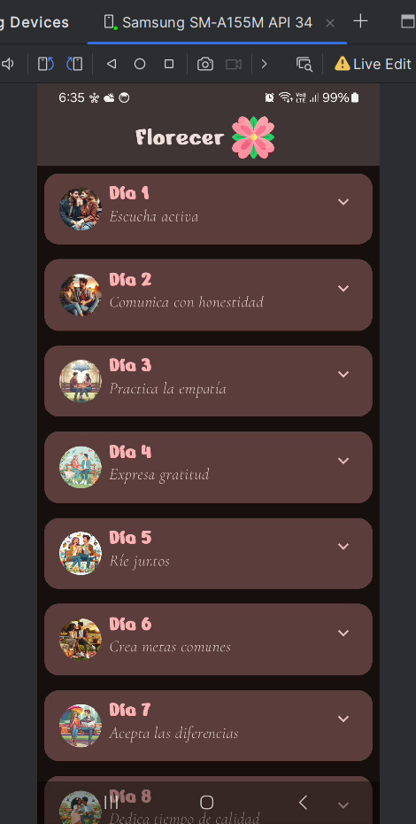

# CODELAB 9 - EJERCICIO 3: FLORECER
### (Mi proyecto)

## Vista previa

## Ejecución en dispositivo físico

### Video de ejecución
[Ingresa aquí para ver el video](https://photos.app.goo.gl/NpQZcCtqLUJeygq18)

* Las imágenes, contenidas en los círculos, fueron creadas con la IA generativa de Designer incorporada en Microsoft Edge